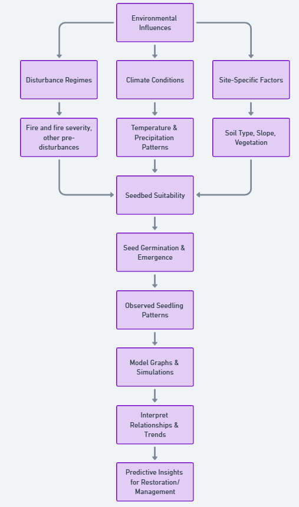
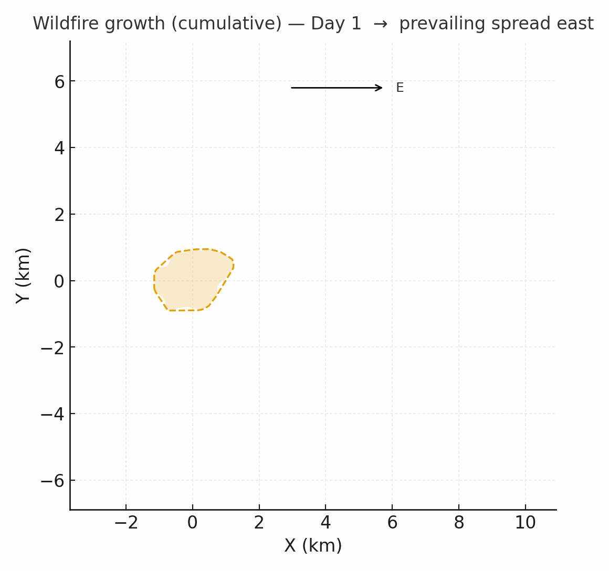

# Conifer Seedling Establishment in Post Wildfire Landscape

<a href="https://github.com/Chathu84/seedling-establishment/edit/main/docs/index.md" title="Edit this page">✏️</a>

[Raw photo location: big2.png](https://github.com/Chathu84/seedling-establishment/edit/main/docs/assets/big2.png)

**Impact:** 

We demonstrate where, how, and why conifer seedlings are present/not present in a post-wildfire landscape in Colorado Front Range using spatial modeling framework producing actionable visuals, a concise briefs, and shareable codes.
---
## Project summary

### Our product 
This repository provides a bayasian spatial modeling framework implemneted using rINLA to predict the seedling establisghmnet potential with uncertainty in a postfire environment penalize with site , fire, and climate pecific characteristics.

### Our question(s) 
<!-- EDIT: Replace bullets with your own. Encourage divergent takes. -->
- Why here or what drives the distribution of conifer seedlings/ and with time (emergence)?
- What is the impact of legecy (dead trees) and other woody vegetation on seedling survival?

### Hypotheses / intentions [Optional: probably not relevant if you are creating an educational tool]
<!-- EDIT: Plain language, short and honest. -->
- We think that seed avilability defines the seedling establisghment regardless fire specific characteristics
- We think thta shade tents or proximity to shrubs/standing dead reduce VPD and raise survival in largely open landscapes.
  

### Why this matters 
<!-- EDIT: 2–3 sentences max, decision-oriented. -->
In the western US and most of the global dry forest landscapes postfire recovery is studied in local scales and are studying site specific questions. We believe that with current high frequency, high intensity wildfires in the dry forest systems, there need a standard way of understanding how these postfire landscapes evolves and how intentional managemnet needed to be supplied. To make these descitions, it is importamt to know the mechanisms on postfire seedling establishments and the drievers impacting. This study provides a Bayasian spatial modeling framework to inform uncertainty driven insights for seedling establishments usings an array of wildires occured in over two decades ago in the Southern Rockies Ponderosa pine forests.  

### Inspirations (papers, datasets, tools)
<!-- EDIT: Swap in your own links. -->
- Publication: [Influential paper title](https://doi.org/xxxx)
- Dataset portal: [Example data hub](https://example.org)
- Tool/tech: [Method or library](https://example.org)

### Field notes / visuals
<!-- EDIT: Replace with a real smartphone photo or sketch; keep filename simple. -->

[Raw photo location: draft_model.png](https://github.com/Chathu84/seedling-establishment/edit/main/docs/assets/draft_model.png)

*Caption: Draft modeling framework with variable inputs and theur potential influences.*

> **Different perspectives:** Briefly capture disagreements or alternate framings. These can unlock innovation.

---

## Day 2 — Data & Methods
*Focus: what we’re testing and building; show a first visual (plot/map/screenshot/GIF).*

### Data sources we’re exploring 📣
<!-- EDIT: Link each source; add size/notes if relevant. -->
- **Source A**

  
[Raw photo location: explore_data_plot.png](https://github.com/CU-ESIIL/Project_group_OASIS/blob/main/docs/assets/explore_data_plot.png)
  *Snapshot showing initial data patterns.*

- Source B — link and 1-line description

### Methods / technologies we’re testing 📣
- Approach 1 (e.g., time-series break detection)
- Approach 2 (e.g., random forest on features)
- Visualization (e.g., map tiles, small multiples)

### Challenges identified
- Data gaps / quality issues
- Method limitations / compute constraints
- Open questions we need to decide on

### Visuals
<!-- EDIT: Swap examples; keep file sizes modest. -->
#### Static figure

[Raw photo location: figure1.png](https://github.com/CU-ESIIL/Project_group_OASIS/blob/main/docs/assets/figure1.png)
*Figure 1.* One line on what this suggests.

#### Animated change (GIF)

[Raw photo location: change.gif](https://github.com/CU-ESIIL/Project_group_OASIS/blob/main/docs/assets/change.gif)
*Figure 2.* One line on what changes across time.

#### Interactive map (iframe)
<iframe
  title="Study area (OpenStreetMap)"
  src="https://www.openstreetmap.org/export/embed.html?bbox=-105.35%2C39.90%2C-105.10%2C40.10&layer=mapnik&marker=40.000%2C-105.225"
  width="100%" height="360" frameborder="0"></iframe>

<a href="https://www.openstreetmap.org/?mlat=40.000&mlon=-105.225#map=12/40.0000/-105.2250">Open full map</a>

> If an embed doesn’t load, put the normal link directly under it.

---

## Final Share Out — Insights & Sharing 
*Focus: synthesis; highlight 2–3 visuals that tell the story; keep text crisp. Practice a 2-minute walkthrough of the homepage 📣: Why → Questions → Data/Methods → Findings → Next.*

[Raw photo location: team_photo.jpg](https://github.com/CU-ESIIL/Project_group_OASIS/blob/main/docs/assets/team_photo.jpg)

### Findings at a glance 📣
<!-- EDIT: 2–4 bullets, each a headline in plain language with a number if possible. -->
- Headline 1 — what, where, how much
- Headline 2 — change/trend/contrast
- Headline 3 — implication for practice or policy

### Visuals that tell the story 📣
<!-- EDIT: Swap visuals; prioritize clarity. -->

[Raw photo location: fire_hull.png](https://github.com/CU-ESIIL/Project_group_OASIS/blob/main/docs/assets/fire_hull.png)
*Visual 1.* Swap in the primary graphic that clearly communicates your core takeaway.

[Raw photo location: hull_panels.png](https://github.com/CU-ESIIL/Project_group_OASIS/blob/main/docs/assets/hull_panels.png)
*Visual 2.* Use a complementary panel, collage, or set of snapshots that reinforces supporting evidence.

[Raw photo location: main_result.png](https://github.com/CU-ESIIL/Project_group_OASIS/blob/main/docs/assets/main_result.png)
*Visual 3.* Highlight an additional visual that captures a secondary insight or next step.

<iframe
  title="Short explainer video (optional)"
  width="100%" height="360"
  src="https://www.youtube.com/embed/ASTGFZ0d6Ps"
  frameborder="0" allow="accelerometer; autoplay; clipboard-write; encrypted-media; gyroscope; picture-in-picture; web-share"
  allowfullscreen></iframe>

### What’s next? 📣
- Immediate follow-ups
- What we would do with one more week/month
- Who should see this next

---

## Featured links (image buttons)
<!-- EDIT: Replace images/links; keep alt text meaningful and motion subtle. -->
<table>
<tr>
<td align="center" width="33%">
  <a href="assets/Seven%20ways%20to%20measure%20fire%20polygon%20velocity-4.pdf"> <strong>Read the brief</strong></a>
</td>
<td align="center" width="33%">
  <a href="https://github.com/CU-ESIIL/Project_group_OASIS/blob/main/code/fired_time_hull_panel.ipynb"> <strong>View code</strong></a>
</td>
<td align="center" width="33%">
  <a href="https://github.com/CU-ESIIL/Project_group_OASIS/blob/main/code/single_hull_demo.py"> <strong>Explore data</strong></a>
</td>
</tr>
</table>

---

## Team
| Name | Role | Contact | GitHub |
|------|------|---------|--------|
| Jane Doe | Lead | jane.doe@example.org | @janedoe |
| John Smith | Analyst | john.smith@example.org | @jsmith |

---

## Storage

Code
Keep shared scripts, notebooks, and utilities in the [`code/`](https://github.com/CU-ESIIL/Project_group_OASIS/tree/main/code) directory. Document how to run them in a README or within the files so teammates and visitors can reproduce your workflow.

Documentation
Use the [`docs/`](https://github.com/CU-ESIIL/Project_group_OASIS/tree/main/docs) folder to publish project updates on this site. Longer internal notes can live in [`documentation/`](https://github.com/CU-ESIIL/Project_group_OASIS/tree/main/documentation); summarize key takeaways here so the public story stays current.

---

## Cite & reuse
If you use these materials, please cite:

> Lastname, A., Lastname, B. (2025). *Project title*. DOI or URL.

License: CC-BY-4.0 unless noted. See dataset licenses on the **[Data](data.md)** page.

---

<!-- EDIT HINTS
- Upload images to docs/assets/ and reference as assets/filename.png
- Keep images ~1200 px wide; avoid >5–8 MB per file.
- Use short, active sentences; this is a scrolling “slide deck.”
- Update this page at least once per day during the sprint.
-->
